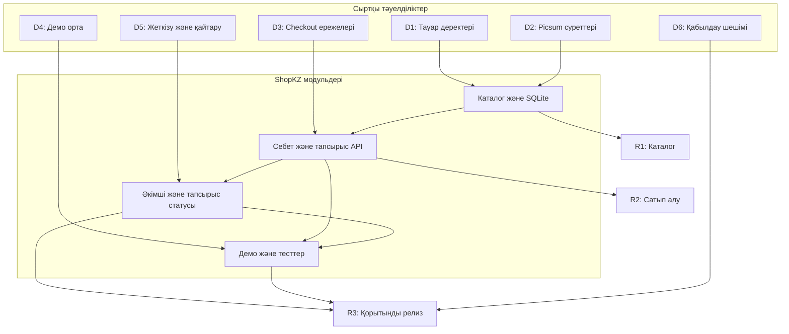

# ShopKZ — жоба жоспары

> Жоспарлық артефакт. Нақты орындалу мен келісімдер бөлек тіркеледі. Команда: 4 студент (болжам). Автор: Исенов Диас АЖ-47.

Л.Н. Гумилев атындағы Еуразия ұлттық университеті

Ақпараттық технологиялар факультеті

Ақпараттық жүйелер білім беру бағдарламасы

# ЖОБАНЫ ЖОСПАРЛАУ

ShopKZ интернет-дүкені

WBS • Релиз жоспары • Тәуелділіктер • RACI • Capacity

Орындаған: Исенов Диас АЖ-47

Дайындалған күні: 06.10.2026

## Жобаның қысқаша паспорты

| Көрсеткіш | Жоспар |
| --- | --- |
| Өнім | ShopKZ оқу интернет-дүкенін семестр ішінде жетілдіру және қабылдау |
| Негізгі пайдаланушылар | Сатып алушы (customer), әкімші (admin) |
| Технологиялар | Node.js, Express, SQLite; HTML/CSS/JavaScript; Jest, Supertest, Playwright |
| Жоспарлау аралығы | 16 апта: 12.10.2026–31.01.2027 (оқу есебіне алынған шартты күнтізбе) |
| Команда | 4 студент; есімі белгілі қатысушы — Исенов Диас |
| Ресурс | Қолжетімді 312 сағат; жұмыс жоспары 300 сағат; бос қор 12 сағат |

Бұл — жоспарлау артефактісі. Релиздер, қабылдау актілері және сыртқы келісімдер орындалды деп көрсетілмейді. Нақты семестр күндері, қалған үш студенттің аты және олардың сабақ кестесі берілмеген: олар есептің айқын болжамдары ретінде қабылданды.

## 1. Жобаның шекарасы және бастапқы жағдайы

ShopKZ пайдаланушыға тауарды іздеуге, себетке қосуға және тапсырысты рәсімдеуге мүмкіндік береді. Әкімші тауарларды, тапсырыс статустарын және промокодтарды басқарады. Мақсат — берілген жобаны тексерілген, құжатталған және демонстрацияға дайын нұсқаға жеткізу.

## 1.1. Архив бойынша расталған жағдай

| Дәлел | Құжатта қолданылған қорытынды |
| --- | --- |
| package.json | Сервер: Express; дерекқор: better-sqlite3; тесттер: Jest, Supertest, Playwright. |
| server.js, db.js, public/app.js | Тіркелу, кіру, каталог, себет, тапсырыс, пікір, wishlist, профиль және admin функциялары бар. |
| POST /api/orders | card және ewallet оқу режимінде өңделеді. Банкке сұрау жіберілмейді; төлемнің сәтсіз жағдайы имитацияланады. |
| practical5/requirements.json | Checkout үшін R01–R09 талаптары бар: авторизация, себет, деректер, карта, промокод және тапсырыс нәтижесі. |
| practical5/results/ | Архивтегі сақталған after есебінде 28/28; regression-jest.json ішінде 69/69 тест өткен. Бұл жұмыста тесттер қайта іске қосылған жоқ. |
| Архивтің файлдар тізімі | 45 файл. .git каталогы мен GitHub Actions workflow жоқ. README ішіндегі дайын git-репозиторий туралы жол архив құрамымен расталмайды. |

## 1.2. Жоспарға кіретін нәтижелер

Қолданыстағы модульдерді талдау және бейімдеу; каталог пен аккаунтты қабылдау; себет пен checkout-ты тексеру; қойма қалдығының дұрыстығын жетілдіру; әкімші, промокод және тапсырыс статустарын қабылдау; автоматты және қолмен тестілеу; іске қосу нұсқаулығы мен қорғау материалдары.

Бір уақытта келетін тапсырыстарда қалдықтың теріс мәнге түспеуін және тапсырыс деректерінің толық сақталуын тексеру жоспарланады. Қажет болса, тапсырыс жасау әрекеттері SQLite транзакциясына біріктіріледі.

## 1.3. Негізгі шектеулер

Нақты эквайринг, нақты курьерлік API және көп пайдаланушысы бар өндірістік дүкен осы семестр жоспарына кірмейді. Жеткізу мен төлем оқу сценарийлері ретінде көрсетіледі. Менеджер және курьер жеке рөлдері қолданыстағы нұсқада іске асырылмаған.

Күнтізбе — ресми университет кестесі емес. Нақты оқу аптасы мен демалыс күндері белгілі болғанда күндер және capacity қайта есептеледі; WBS құрылымы сақталады.

## 2. Үш деңгейлі WBS

1-деңгей — толық жоба; 2-деңгей — алты негізгі жұмыс блогы; 3-деңгей — бағаланатын жұмыс пакеттері. Сағат — команданың адам-сағаты, күнтізбелік ұзақтық емес. Қолданыстағы кодтың болуы ескерілген: жұмысқа бейімдеу, тексеру және қабылдау кіреді.

| WBS | Жұмыс / нәтиже | Жетекші | Сағат | R1 / R2 / R3 |
| --- | --- | --- | --- | --- |
| 1 | ShopKZ жобасы — 1-деңгей | Команда | 300 | 112 / 100 / 88 |
| 1.1 | Жобаны басқару — 2-деңгей |  | 36 | 16 / 10 / 10 |
| 1.1.1 | WBS, релиз жоспары және capacity — 3-деңгей | Диас | 8 | 8 / 0 / 0 |
| 1.1.2 | Үйлестіру, backlog және тәуекелдер — 3-деңгей | Диас | 20 | 6 / 7 / 7 |
| 1.1.3 | Тапсырыс берушімен келісу — 3-деңгей | Диас | 8 | 2 / 3 / 3 |
| 1.2 | Талаптар мен жобалау — 2-деңгей |  | 36 | 36 / 0 / 0 |
| 1.2.1 | Талаптар және қабылдау шарттары — 3-деңгей | Диас | 14 | 14 / 0 / 0 |
| 1.2.2 | Тауар деректері және бизнес-ережелер — 3-деңгей | Диас | 10 | 10 / 0 / 0 |
| 1.2.3 | Пайдаланушы ағындары және прототип — 3-деңгей | Frontend | 12 | 12 / 0 / 0 |
| 1.3 | Пайдаланушы интерфейсі — 2-деңгей |  | 54 | 16 / 24 / 14 |
| 1.3.1 | Каталог, іздеу және тауар карточкасы — 3-деңгей | Frontend | 16 | 16 / 0 / 0 |
| 1.3.2 | Себет және тапсырысты рәсімдеу — 3-деңгей | Frontend | 24 | 0 / 24 / 0 |
| 1.3.3 | Жеке кабинет және әкімші интерфейсі — 3-деңгей | Frontend | 14 | 0 / 0 / 14 |
| 1.4 | Сервер және дерекқор — 2-деңгей |  | 90 | 28 / 36 / 26 |
| 1.4.1 | SQLite, тіркелу және рөлдер — 3-деңгей | Backend | 28 | 28 / 0 / 0 |
| 1.4.2 | Тапсырыс, төлем имитациясы және қалдық — 3-деңгей | Backend | 36 | 0 / 36 / 0 |
| 1.4.3 | Әкімші API, промокод, пікір және профиль — 3-деңгей | Backend | 26 | 0 / 0 / 26 |
| 1.5 | Тестілеу және қабылдау — 2-деңгей |  | 54 | 12 / 12 / 30 |
| 1.5.1 | Test Plan, тест-кейстер және трассировка — 3-деңгей | QA | 10 | 10 / 0 / 0 |
| 1.5.2 | Автотесттер және регрессия — 3-деңгей | QA | 24 | 2 / 12 / 10 |
| 1.5.3 | E2E, ақауларды қайта тексеру және UAT — 3-деңгей | QA | 20 | 0 / 0 / 20 |
| 1.6 | Релиз және тапсыру — 2-деңгей |  | 30 | 4 / 18 / 8 |
| 1.6.1 | Орта, GitHub және іске қосу баптаулары — 3-деңгей | Frontend | 8 | 4 / 4 / 0 |
| 1.6.2 | Демо нұсқаны шығару және тексеру — 3-деңгей | Frontend | 14 | 0 / 14 / 0 |
| 1.6.3 | README, қорытынды есеп және қорғау — 3-деңгей | Диас | 8 | 0 / 0 / 8 |

Жетекші пакеттің нәтижесін үйлестіреді; барлық сағатты жалғыз өзі орындамайды. Нақты еңбек үлесі 7.4 бөліміндегі ресурс матрицасында көрсетілген. Жоғарғы деңгей сағаттары төменгі деңгейлердің қосындысы, қайта қосылмайды.

## 3. WBS сөздігі: бес жұмыс пакеті

Әр пакет үшін жұмыс шекарасы, тексерілетін нәтиже, жауапты адам, бағалау және тәуелділік көрсетілген.

## 1.2.1 — Талаптар және қабылдау шарттары

| Өріс | Сипаттама |
| --- | --- |
| Мазмұны | Қолданыстағы функцияларды тексеру; checkout R01–R09 талаптарын backlog және қабылдау шарттарымен байланыстыру; рөлдердің шекарасын анықтау. |
| Нәтиже | Талаптар тізімі, қабылдау шарттары, талап–тест байланысы бар матрица. |
| Дайындық критерийі | R01–R09 түгел қамтылған; customer/admin құқықтары жазылған; каталог пен қайтару ережелеріне тапсырыс беруші келісім берген. |
| Жауапты / баға / мерзім | Диас; 14 адам-сағат; R1, 1–2 апта. |
| Тәуелділік / кірмейді | D1, D3, D5 бойынша алдын ала талаптар. Банкпен келісім немесе нақты курьерлік интеграция кірмейді. |

## 1.3.2 — Себет және тапсырысты рәсімдеу

| Өріс | Сипаттама |
| --- | --- |
| Мазмұны | Себет санын өзгерту, checkout деректерін енгізу, қате хабарламаларын көрсету, тапсырыс нәтижесіне өту; бар интерфейсті бейімдеу. |
| Нәтиже | public/app.js және styles.css ішіндегі тексерілген сатып алу ағыны. |
| Дайындық критерийі | Авторизациясыз тапсырыс қабылданбайды; бос себетке қате шығады; қате мекенжай/телефон және карта деректері түсінікті көрсетіледі; сәтті тапсырыс көрінеді. |
| Жауапты / баға / мерзім | Frontend студенті; 24 адам-сағат; R2, 6–9 апта. |
| Тәуелділік / кірмейді | 1.4.2 API және D3 талаптары. Нақты банк төлемін өңдеу кірмейді. |

## 1.4.2 — Тапсырыс, төлем имитациясы және қалдық

| Өріс | Сипаттама |
| --- | --- |
| Мазмұны | POST /api/orders логикасы; серверлік валидация; жеңілдікті есептеу; тапсырыс пен қалдықты бірізді сақтау; төлемнің бас тартуын тексеру. |
| Нәтиже | Тексерілген API, қажет түзетулер және тестпен расталған дерекқор мінез-құлқы. |
| Дайындық критерийі | Сәтті сценарий processing жасайды, себетті тазалайды, қалдықты азайтады; бас тарту деректі өзгертпейді; екі қатар тапсырыс артық сатуға әкелмейді. |
| Жауапты / баға / мерзім | Backend студенті; 36 адам-сағат; R2, 6–9 апта. |
| Тәуелділік / кірмейді | 1.4.1 дерекқоры, D3 ережелері. Нақты ақша аударымы кірмейді. |

## 3. WBS сөздігі (жалғасы)

## 1.5.2 — Автотесттер және регрессия

| Өріс | Сипаттама |
| --- | --- |
| Мазмұны | Jest/Supertest тесттерін тексеру және қажетті сценарийлерді толықтыру; practical5 checkout кейстерін қайта іске қосу; ақауды тіркеу және түзетілген нұсқаны қайта тексеру. |
| Нәтиже | Ағымдағы commit үшін тест есебі, Bug Report және талап–тест матрицасы. |
| Дайындық критерийі | npm test және npm run practical5 сәтті; бастапқы 69 және 28 тест жоғалмаған; қосылған тесттер де өткен; blocker/critical ақаулар жабылған. |
| Жауапты / баға / мерзім | QA студенті; 24 адам-сағат; R1 — 2, R2 — 12, R3 — 10 сағат. |
| Тәуелділік / кірмейді | 1.3 және 1.4 модульдері; тәуелділіктер орнатылған орта. Архивтегі ескі есеп ағымдағы commit-тің дәлелі ретінде қолданылмайды. |

## 1.6.3 — README, қорытынды есеп және қорғау

| Өріс | Сипаттама |
| --- | --- |
| Мазмұны | Орнату мен іске қосу нұсқаулығын нақтылау; WBS, релиздер, RACI және capacity құжаттарын жинау; нақты скриншоттар мен demo сценарийін дайындау. |
| Нәтиже | README, қорытынды Word есебі, қорғау сценарийі және репозиторий болса оның сілтемесі. |
| Дайындық критерийі | Таза ортада README арқылы іске қосылады; барлық бес артефакт бар; жаңа тест нәтижелері берілген; скриншоттар нақты күйді көрсетеді; қабылдаушы демоны тексерген. |
| Жауапты / баға / мерзім | Диас; 8 адам-сағат; R3, 14–16 апта. |
| Тәуелділік / кірмейді | R1–R3 нәтижелері, D6. GitHub скриншоттары жасалмаған жағдайда орындалды деп жазылмайды. |

## Барлық пакеттерге ортақ Definition of Done

Код қаралған; қабылдау шарттары орындалған; қатысты тесттер өткен; жаңа blocker/critical ақау жоқ; нұсқаулық жаңартылған; өзгеріс нұсқасы анық көрсетілген. GitHub қолданылғанда әр пакет issue және commit немесе Pull Request-пен байланыстырылады.

## 4. Семестрге арналған релиз жоспары

Үш инкремент бір-бірін толықтырады. Қазіргі архивте функциялар бар болғандықтан, бұл — оларды кезекпен жетілдіру және ресми қабылдауға дайындау жоспары, бұрын орындалған жұмыстың тарихы емес.

## R1 — Каталог және аккаунт

| Өріс | Мән |
| --- | --- |
| Мерзім | 1–5 апта; 12.10–15.11.2026. Релиз: 13.11.2026. |
| Мақсат / құрам | Мақсат: пайдаланушы тауарды тауып, жүйеге кіре алады. Талаптар, прототип, SQLite құрылымы, тіркелу/кіру, customer/admin шектеуі, каталог, іздеу, фильтр, тауар карточкасы. Тест жоспары және іске қосу ортасы. |
| WBS байланысы | WBS 1.2.*, 1.3.1, 1.4.1; басқару және тест жұмыстарының R1 бөлігі. |
| Ресурс | Жоспар: 112 сағат; capacity: 116; бос қор: 4. |
| Қабылдау | Каталог пен кіру демосы; admin-only API-ге customer кірмейді; қатысты тесттер сәтті; D1 деректері бекітілген; D2 сурет fallback-ы тексерілген. |

## R2 — Сатып алу ағыны

| Өріс | Мән |
| --- | --- |
| Мерзім | 6–10 апта; 16.11–20.12.2026. Релиз: 18.12.2026. |
| Мақсат / құрам | Мақсат: сатып алушы оқу тапсырысын рәсімдей алады. Себет, саны, checkout, card/ewallet имитациясы, негізгі промокод қолдану, жалпы сома, қалдық, processing статусы және order history. Демо орта және регрессия. |
| WBS байланысы | WBS 1.3.2, 1.4.2, 1.6.2; 1.6.1 аяқтау; басқару/тестілеу R2 бөлігі. |
| Ресурс | Жоспар: 100 сағат; capacity: 104; бос қор: 4. |
| Қабылдау | 28 checkout кейсі қайта өткен; сәтті және бас тарту сценарийлері дұрыс; қатар тапсырыс қалдықты бұзбайды; сатып алу ағыны демода қайталанады. |

## R3 — Әкімші және қорытынды қабылдау

| Өріс | Мән |
| --- | --- |
| Мерзім | 11–16 апта; 21.12.2026–31.01.2027. Релиз: 29.01.2027. |
| Мақсат / құрам | Мақсат: өнімді көрсетуге және тапсыруға дайын ету. Admin тауар CRUD, промокод басқару, тапсырыс статусы/қайтару, профиль, пікір, wishlist; E2E, жүйелік және UAT тексеруі; README және қорытынды есеп. |
| WBS байланысы | WBS 1.3.3, 1.4.3, 1.5.3, 1.6.3; регрессия/басқару R3 бөлігі. |
| Ресурс | Жоспар: 88 сағат; capacity: 92; бос қор: 4. |
| Қабылдау | Регрессия, system және E2E тесттер өткен; customer admin API-ді пайдалана алмайды; қайтару қалдықты бір рет қана қалпына келтіреді; таза іске қосу мен қабылдау демосы орындалған. |

## 4.1. Вехалар және дайындық критерийлері

| Веха / күн | Нәтиже және өлшенетін критерий | Шешім иесі |
| --- | --- | --- |
| M0 — 23.10.2026; Талаптар базасы | WBS-тің 18 пакеті бағаланған; 3 релизге бөлінген; R01–R09 талаптары сәйкестендірілген; 6 сыртқы тәуелділік тіркелген; 4 қатысушының қолжетімділігі келісілген. | Диас; талаптарды тапсырыс беруші бекітеді |
| M1 — 13.11.2026; R1 қабылдау | Тіркелу → кіру → тауар іздеу ағыны көрсетіледі; customer/admin құқықтары тексерілген; D1 расталған; D2 үшін fallback бар; іске қосу нұсқаулығы жұмыс істейді. | Тапсырыс беруші / оқытушы |
| M2 — 18.12.2026; R2 қабылдау | 28 checkout тестінің бәрі өткен; талап R09 бойынша сәтті және сәтсіз тапсырыс деректері тексерілген; қатар тапсырыста теріс қалдық жоқ; system сатып алу ағыны сәтті. | Тапсырыс беруші / оқытушы |
| M3 — 15.01.2027; Scope freeze | Қалған жаңа функциялар тоқтатылады; admin/қайтару/профиль кейстері бекітілген; D6 бойынша demo күні мен қабылдау тәртібі келісілген; ашық ақауларға иелер берілген. | Диас және тапсырыс беруші |
| M4 — 29.01.2027; R3 және тапсыру | npm test, practical5, system және E2E іске қосулары сәтті; critical/blocker ақау жоқ; README таза ортада тексерілген; Word есебі мен demo бар; қабылдау қорытындысы тіркелген. | Тапсырыс беруші / оқытушы |

## 4.2. Семестрдің жұмыс ырғағы

| Кезең | Жұмыс тәртібі |
| --- | --- |
| Қалыпты апта | Екі кешкі сессия және бір демалыс күнгі блок; аптасына 15 минут командалық sync; жұппен шолу және тест. |
| 7 және 14-апта | Бақылау жұмыстары кезеңі: жүктеме азаяды, жаңа көлем қосылмайды; шағын түзету және шолу. |
| 15 және 16-апта | Емтихан кезеңі: негізгі функциялар M3-ке дейін дайын; тек регрессия, құжат және қорғау. Жылдамдықты қалыпты апта деңгейінде жоспарлауға болмайды. |

Қабылдау критерийі орындалмаса, веха жабылмайды: QA ақауды тіркейді, Диас әсерін бағалайды, команда түзетеді және қайта тексереді. Уақыт жетпесе, wishlist пен пікірлердің қосымша безендірілуі қысқарады; авторизация, тапсырыс, қалдық және тесттер сақталады.

## 5. Сыртқы тәуелділіктер тізілімі

«Растау күні» төменде жоспарлы соңғы мерзім ретінде берілген. Нақты келісім туралы дәлел жоқ болғандықтан, барлық жолдың бастапқы статусы — «расталмаған». Расталғаннан кейін нақты күн және хат/issue сілтемесі енгізіледі.

| ID | Сыртқы тәуелділік / ие | Ішкі ие / растау күні | Әсері | Растау дәлелі және балама |
| --- | --- | --- | --- | --- |
| D1 | Тауар атауы, баға, санат және қалдық; Сыртқы ие: оқу тапсырыс берушісі / дүкен өкілі | Диас; 16.10.2026 | R1; 1.2.2, 1.3.1 | 12 seed тауарын келісу; деректер тізіміне келісім. Кешіксе: seed деректері «оқу дерегі» ретінде қалады. |
| D2 | Тауар суреттері; Сыртқы көз: Picsum қызметі; таңдау шешімі — тапсырыс беруші | Frontend; 23.10.2026 | R1; 1.3.1 | Бар img URL-дерін тексеру және локал placeholder бекіту. Қызмет қолжетімсіз болса, каталог жергілікті fallback-пен ашылады. |
| D3 | Checkout және төлем форматы; Сыртқы ие: тапсырыс беруші | Диас; 23.10.2026 | R2; 1.3.2, 1.4.2 | R01–R09 және card/ewallet имитациясын бекіту. Нақты эквайринг сұралса, бөлек scope/ресурс шешімі керек. |
| D4 | Демо орналастыру ортасы; Сыртқы ие: университет IT / таңдалатын хостинг провайдері | Frontend; 13.11.2026 | R2; 1.6.1–1.6.2 | Node процесі, SQLite тұрақты дискісі, кіру параметрлері келісілген. Кешіксе: оқытушы бекіткен жергілікті demo. |
| D5 | Жеткізу, статус және қайтару саясаты; Сыртқы ие: тапсырыс беруші / жеткізу өкілі | Диас; 06.11.2026 | R2–R3; 1.4.2–1.4.3 | Статустар мен 30 минуттық оқу қайтару ережесіне келісім. Нақты курьер API жоқ; тек оқу сценарийі. |
| D6 | Қабылдау және қорғау форматы; Сыртқы ие: оқытушы / қабылдаушы | Диас; 15.01.2027 | M3–M4; 1.5.3, 1.6.3 | Demo күні, кейстер және есеп құрамы келісілген. Кешіксе: материал дайын тұрады, қабылдау статусы ашық қалады. |

## 5.1. Ішкі интеграциялар

Браузердегі public/app.js → Express REST API → SQLite дерекқоры. Авторизация express-session арқылы іске асады; API деректері Jest/Supertest арқылы тексеріледі; Playwright пайдаланушы ағынын браузерде тексереді. Бұлар команданың бақылауындағы ішкі байланыстар, сыртқы тәуелділік санына кірмейді.

## 5.2. Шешімдерді күту тәртібі

Диас аптасына бір рет D1–D6 статусын тексереді. Мерзімге дейін келісім болмаса, вехаға әсерді және баламаны тапсырыс берушіге ұсынады. «Расталды» күйі тек нақты күн мен шешім дәлелі болғанда қойылады.

## 5.3. Тәуелділіктер картасы

Сурет 1. Жебе шарттың немесе модульдің қай нәтижеге қажет екенін көрсетеді. D1–D6 иелері, жоспарлы растау күндері және баламалары тізілімде берілген. Mermaid коды А қосымшасында бар.

Негізгі тізбек: тауар деректері → каталог → себет/тапсырыс → admin және статус → қорытынды demo. Picsum жеке сыртқы көзі ретінде көрсетілген; жергілікті fallback оның релизді бөгемеуіне мүмкіндік береді. D6 — техникалық API емес, қабылдау шешімі.

## 6. Команда топологиясы және RACI

Топология: бір өнім ағынына жауап беретін шағын кросс-функционалды команда (stream-aligned). Команда каталогтан бастап тапсырыс пен әкімшіге дейінгі толық пайдаланушы ағынын орындайды. Төрт студентке бөлек frontend/backend/QA командаларын құру қосымша келісім шығынын арттырады.

| Қатысушы / рөл | Жауапкершілік және өзара әрекет |
| --- | --- |
| Исенов Диас; PM / BA + Full-stack қолдау | Талаптар, WBS, релиз жоспары, тәуелділіктер, scope және тапсырыс берушімен келісім. Жүктемеде 24 сағат сервер жұмысына және басқа пакеттерге техникалық қолдау бар. |
| 2-студент; Frontend / UX + release қолдау | public интерфейсі, прототип, каталог, себет, checkout және admin экраны. Демо орта мен іске қосу құжаттарына көмектеседі. |
| 3-студент; Backend / DB | server.js, db.js, API, SQLite, сессия, рөлдер, тапсырыс/қалдық және транзакциялар. Сервер кодын шолу және интеграциялық тесттерге қолдау. |
| 4-студент; QA | Test Plan, тест-кейстер, регрессия, E2E және system; ақау есебі; талаптарға сәйкестік пен қабылдау дәлелі. |
| Сыртқы тапсырыс беруші / оқытушы | Талаптарды, оқу сценарийін және релизді қабылдайды. Студенттік capacity құрамына кірмейді. |

Ішкі өзара әрекет — collaboration: frontend пен backend API шартын бірге келіседі, QA әр инкрементте тексереді. Хостингпен және сурет көзімен байланыс — дайын қызметті пайдалану; тапсырыс берушімен байланыс — шешімдерді бекіту.

## 6.1. Кілттік артефактілерге RACI

R — орындайды; A — нәтижеге түпкілікті жауап береді/бекітеді; C — кеңес береді; I — хабардар болады. Әр жолда бір ғана A бар; A/R бір адам екі міндетті атқарғанын білдіреді.

| Артефакт | Диас | Front | Back | QA | Тапсырыс; беруші |
| --- | --- | --- | --- | --- | --- |
| WBS және сөздік | A/R | C | C | C | I |
| Релиз жоспары, capacity | A/R | C | C | C | C |
| Талаптар және қабылдау шарттары | R | C | C | C | A |
| UX прототип / интерфейс | A | R | C | C | C |
| DB схемасы және API шарты | C | C | A/R | C | I |
| Тапсырыс пен қалдық логикасы | C | C | A/R | C | I |
| Test Plan және тест-кейстер | C | C | C | A/R | C |
| Код өзгерісі / Pull Request | A | R | R | C | I |
| Bug Report және тест есебі | C | C | C | A/R | I |
| Тәуелділіктер тізілімі | A/R | C | C | C | C |
| Демо орта және README | A | R | C | C | I |
| Релизді қабылдау қорытындысы | R | C | C | C | A |

## 7. Оқу жүктемесін ескерген capacity есебі

Capacity — студенттердің жобаға нақты бөле алатын сағаты. Төрт адам × 40 сағат деп есептеу қолданылмайды: сабақ, өздік жұмыс, бақылау және емтихан уақытын ескереміз. Жеке сабақ кестелері берілмегендіктен, төмендегі қолжетімділік — команда келісуі тиіс жоспарлық бағалау.

## 7.1. Бір қалыпты аптаның негіздемесі

| Қатысушы | Сабақ / өздік жұмыс, сағ. | Жобаға бөлуге болатын уақыт | Қалыпты апта |
| --- | --- | --- | --- |
| Диас | 28 / 12 | Екі кеш × 2 сағ. + демалыс күні 4 сағ. | 8 сағ. |
| Frontend | 28 / 12 | Екі кеш × 2 сағ. + демалыс күні 4 сағ. | 8 сағ. |
| Backend | 30 / 14 | Екі кеш × 1,5 сағ. + демалыс күні 4 сағ. | 7 сағ. |
| QA | 30 / 16 | Екі кеш × 1,5 сағ. + демалыс күні 3 сағ. | 6 сағ. |

Сабақ және өздік жұмыс — түсіндіруге алынған болжам, университеттің ресми жүктемесі емес. Жоба уақыты бос терезелерден есептеледі; оқу сағаты одан қайта шегерілмейді.

## 7.2. Семестрлік формула

16 апта = 12 қалыпты апта + 2 бақылау аптасы (7, 14) + 2 емтихан аптасы (15, 16).

Жалпы қолжетімділік = 12 × қалыпты апта сағаты + 2 × бақылау апта сағаты + 2 × емтихан апта сағаты.

Жоспарлауға болатын capacity = жалпы қолжетімділік × 0,80.

20% қор — күтпеген оқу тапсырмасы, ауру, техникалық кедергі және оқу/мереке күнтізбесіндегі ауытқулар. Жоспарланған жиналыс, код шолу және тесттер WBS ішінде бар; олар capacity-ден екінші рет шегерілмейді.

| Қатысушы | Қалыпты; 12 апта | Бақылау; 2 апта | Емтихан; 2 апта | Жалпы | 20% қор | Таза; capacity |
| --- | --- | --- | --- | --- | --- | --- |
| Диас | 12×8=96 | 2×4=8 | 2×2=4 | 108 | 21,6 | 86,4 |
| Frontend | 12×8=96 | 2×4=8 | 2×2=4 | 108 | 21,6 | 86,4 |
| Backend | 12×7=84 | 2×3=6 | 2×2=4 | 94 | 18,8 | 75,2 |
| QA | 12×6=72 | 2×3=6 | 2×1=2 | 80 | 16 | 64 |
| Команда | 348 | 28 | 14 | 390 | 78 | 312 |

## 7.3. Нақты кесте белгілі болғанда

Әр қатысушы апталық бос терезесін растайды. Ресми демалыс немесе жеке жұмыс анықталса, сол апта сағаты төмендетіледі; кейін 20% қор қолданылады. Өзгеріс WBS жүктемесімен салыстырылады. Барлық команда әр қалыпты аптада 1 сағат кем бөлсе, таза capacity 38,4 сағатқа азайып, 273,6 болады: бұл кезде 300 сағаттық көлемді қысқарту қажет.

## 7.4. Capacity мен WBS көлемін салыстыру

Негізгі жұмыс 300 адам-сағатқа бағаланды. Төмендегі үлестірім пакет жетекшісі мен барлық орындаушылардың еңбегін ажыратады; әр сағат бір рет қана саналады.

| WBS блогы | Диас | Frontend | Backend | QA | Жиыны |
| --- | --- | --- | --- | --- | --- |
| 1.1 Жобаны басқару | 28 | 3 | 3 | 2 | 36 |
| 1.2 Талаптар мен жобалау | 22 | 8 | 4 | 2 | 36 |
| 1.3 Пайдаланушы интерфейсі | 2 | 50 | 0 | 2 | 54 |
| 1.4 Сервер және дерекқор | 24 | 4 | 58 | 4 | 90 |
| 1.5 Тестілеу және қабылдау | 2 | 4 | 4 | 44 | 54 |
| 1.6 Релиз және тапсыру | 6 | 15 | 3 | 6 | 30 |
| Жоспарланған жұмыс | 84 | 84 | 72 | 60 | 300 |
| Қолжетімді capacity | 86,4 | 86,4 | 75,2 | 64 | 312 |
| Бос ресурс | 2,4 | 2,4 | 3,2 | 4 | 12 |

Жүктеме жеке қатысушылардың capacity-сінен аспайды: Диас — 97,2%; Frontend — 97,2%; Backend — 95,7%; QA — 93,8%. 12 сағат бос ресурс 20% күтпеген уақыт қорынан бөлек: 78 сағат негізгі commitment-ке алдын ала кірмеген.

## 7.5. Инкремент бойынша тексеру

| Инкремент | Апта түрлері | Жалпы сағат | ×0,80 | WBS | Бос қор |
| --- | --- | --- | --- | --- | --- |
| R1 | 5 қалыпты | 5×29=145 | 116 | 112 | 4 |
| R2 | 4 қалыпты + 1 бақылау | 4×29+14=130 | 104 | 100 | 4 |
| R3 | 3 қалыпты + 1 бақылау + 2 емтихан | 3×29+14+2×7=115 | 92 | 88 | 4 |
| Жиыны | 12 қалыпты + 2 бақылау + 2 емтихан | 390 | 312 | 300 | 12 |

## 7.6. Қатысушылардың инкременттік жүктемесі

| Қатысушы | R1 жұмыс / capacity | R2 жұмыс / capacity | R3 жұмыс / capacity |
| --- | --- | --- | --- |
| Диас | 32 / 32 | 28 / 28,8 | 24 / 25,6 |
| Frontend | 32 / 32 | 28 / 28,8 | 24 / 25,6 |
| Backend | 25,6 / 28 | 24,4 / 24,8 | 22 / 22,4 |
| QA | 22,4 / 24 | 19,6 / 21,6 | 18 / 18,4 |

Семестр бойынша ғана емес, әр инкрементте де жеке жүктеме қолжетімді сағаттан аспайды. Диас пен Frontend үшін R1 толық толған; қосымша жұмыс 20% қорды commitment-ке қоспай, scope өзгерісі арқылы шешіледі.

## 7.7. Емтихан аптасының шектеуі

R3-тің таза capacity-сі 92 сағат болғанымен, 15–16 апталарда командаға барлығы 11,2 сағат қана қолжетімді. Сондықтан R3 жұмысының 80 сағаты 11–14 аптада, қалған 8 сағаты 15–16 аптада жоспарланады. Әкімші және негізгі ақау түзетулері M3-ке дейін аяқталады; соңғы екі аптада құжат, қысқа регрессия және қорғау қалады.

Соңғы 8 сағаттың үлесі: Диас — 2,4; Frontend — 2; Backend — 2; QA — 1,6. Бұл әр қатысушының екі емтихан аптасына қолжетімді таза capacity-сінен аспайды: 3,2 / 3,2 / 3,2 / 1,6 сағат.

Командалық sync үшін 16 × 0,25 × 4 = 16 адам-сағат қарастырылған: 1.1.2 пакетіндегі 20 сағаттың 16 сағаты sync-ке, қалған 4 сағаты backlog пен тәуекелді жаңартуға жұмсалады. 1.1.1 және 1.1.3 пакеттеріндегі 8+8 сағат жоспарлау мен келісуге бөлек қарастырылған. Техникалық шолу тиісті пакет ішінде есептеледі.

## 8. GitHub және скриншоттар

Берілген тапсырманың міндетті артефактілері: WBS, релиз жоспары, тәуелділіктер картасы, RACI және capacity. GitHub сілтемесі мен скриншоттар тапсырма мәтінінде міндетті талап ретінде көрсетілмеген. Оларды жұмыс процесінің қосымша дәлелі ретінде қосуға болады.

## 8.1. Репозиторийге енгізілетін құрылым

Қолданыстағы server.js, db.js, utils.js, public/, tests/, practical5/, package.json, package-lock.json және README.md сақталады. docs/ ішінде жоспарлау материалдары орналастырылады; 18 WBS пакеті 18 issue ретінде тіркеліп, үш релиз milestone-ына бөлінеді. Бірнеше релизге созылатын басқару/тест пакетінде R1/R2/R3 checklist қолданылады немесе бір parent issue астында бөлек subtasks ашылады.

Архивте .git жоқ, сондықтан алғаш рет git init қажет. .env, node_modules және жергілікті SQLite деректері репозиторийге қосылмайды. .gitignore бірнеше нақты DB атауын қамтиды; жаңа тест DB атауы пайда болса, оны да ignore тізіміне енгізу керек. Жұмыс репозиторийі: https://github.com/DiasIsenov06/ShopKZ. Файлдар мен Issues 06.10.2026 күні жасалды; нақты скриншоттар кейін енгізіледі.

## 8.2. Есепке қосуға болатын нақты скриншоттар

| № | Не көрінуі тиіс | Қай бөлімге қою |
| --- | --- | --- |
| 1 | GitHub Code: репозиторий атауы, файлдар, README және соңғы commit. URL көрінсін. | Жоба паспорты / қосымша |
| 2 | Issues: WBS ID бар тапсырмалар, responsible assignee және релизге байланысы. | WBS бөлімі |
| 3 | Milestones: R1, R2, R3, мақсаттары және жоспарлы күндері. | Релиз жоспары |
| 4 | Projects тақтасы (қолданылса): Todo, In progress, Review, Done және карточкалар. | Команда және жұмыс тәртібі |
| 5 | Тәуелділік issue-лері: кемінде D1, D3, D4; owner, due date және растау статусы. | Тәуелділіктер тізілімі |
| 6 | Өз терминалыңдағы npm test және npm run practical5: команда, Passed/Failed және күн/commit контексті. | Қабылдау дәлелі |
| 7 | ShopKZ браузері: каталог, сәтті оқу тапсырысы және әкімші панелі. | R1/R2/R3 нәтижелері |
| 8 | Actions сәтті прогон (тек workflow шынымен қосылса). | Қосымша дәлел, міндетті емес |

Скриншоттардың өзі әзірге берілмеген және құжатқа ойдан қосылмады. Репозиторий құрылғаннан кейін нақты суреттер мен оның URL-і осы бөлімге енгізіледі. «Done» тек орындалған және тексерілген тапсырмаларға қойылады.

## А қосымшасы. Mermaid диаграммасының коды

Кодты Mermaid қолдайтын Markdown құжатына немесе редакторға енгізуге болады. Жебелер 5-бөлімдегі картаға сәйкес келеді; жауаптылар мен растау мерзімдері тәуелділіктер тізілімінен оқылады.

## Қорғауға арналған қысқа түсіндірме

Мен ShopKZ интернет-дүкені үшін жобаны үш деңгейлі WBS-ке бөлдім: жоба, алты жұмыс блогы және он сегіз пакет. Бес пакетке жеке сөздік жасадым. Семестрге үш инкремент жоспарладым: каталог пен аккаунт, сатып алу ағыны және қорытынды әкімші релизі. Әр веханың өлшенетін қабылдау шарттары бар.

Тәуелділіктер картасында тауар деректері, сурет көзі, checkout ережелері, демо орта, жеткізу саясаты және қабылдау шешімі көрсетілген. Әрқайсысына жауапты рөл және жоспарлы растау күні берілді. Команда төрт студенттен тұрады. Сабақ пен емтихан жүктемесін ескергенде жалпы 390 сағат шығады; 20 пайыз қорды алып тастағанда 312 сағат қалады. WBS 300 сағат, сондықтан 12 сағат бос ресурс бар. Бұл есеп нақты сабақ кестесімен қайта тексеріледі.

Негізгі дереккөз: пайдаланушы берген ShopKZ_Practical5(1).zip архиві. Мерзімдер, команда құрамы және сағаттар — осы оқу жұмысы үшін ашық көрсетілген жоспарлау болжамдары.

## GitHub жұмыс кеңістігінің нақты күйі

06.10.2026: бастапқы жоба импортталды; 27 ашық issue тіркелді.

- [Релиздер, WBS және сыртқы тәуелділіктер индексі](issue-index.md)
- R1–R3 — Issues; GitHub Milestones объектілері әзірге жасалмаған.
- Тесттер импорт кезінде қайта іске қосылмаған; архивтегі сақталған есептер сақталған.
